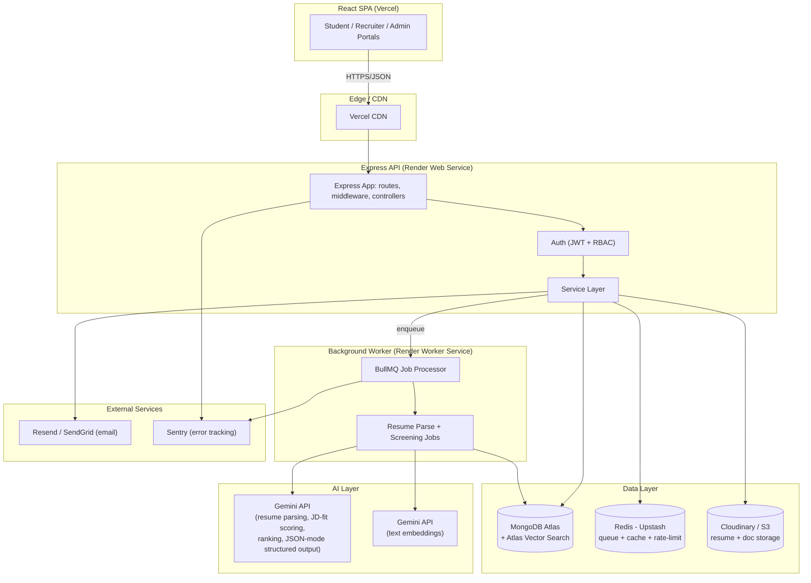
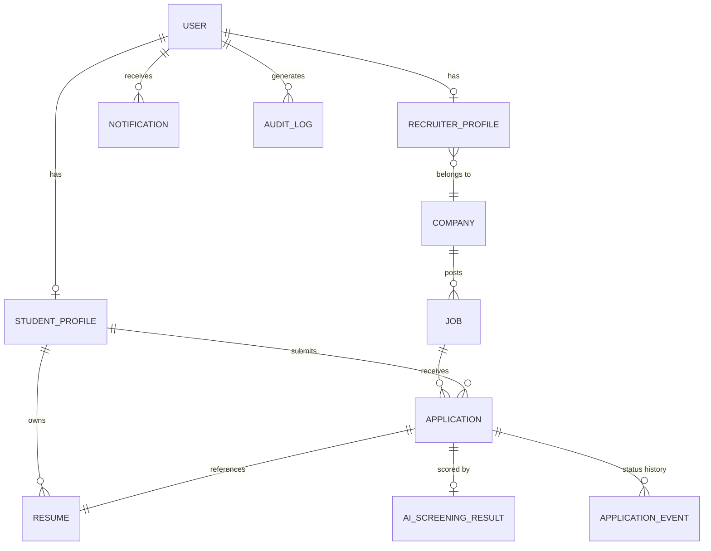
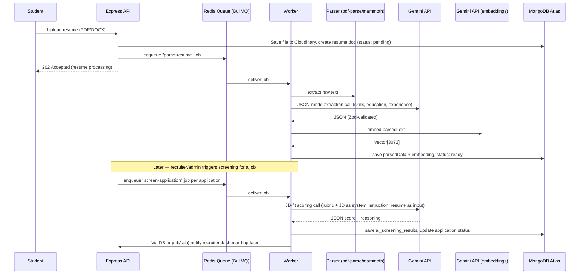
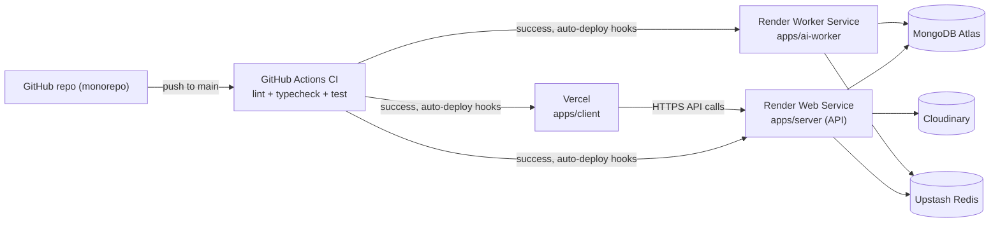

# AI-Powered TPO Management System — System Architecture

> Full-stack placement platform for students, recruiters, and TPO administrators, with AI-powered resume screening, semantic search, and placement analytics.
> Stack: **React (Vite) · Node.js · Express · MongoDB (Atlas) · Gemini API (Google) · Gemini embeddings**

Decisions locked in for this doc: **Gemini API** for AI screening/ranking and embeddings, **Managed PaaS deployment** (Vercel + Render + MongoDB Atlas), **Monorepo** layout. (Originally Claude+Voyage — swapped to Gemini for both generation and embeddings; see §7.4/§7.5.)

---

## 1. Goals & Non-Goals

**Goals**
- Three role-based portals (Student, Recruiter, TPO Admin) behind one auth system.
- AI resume screening: parse resumes, score/rank candidates against a job description, explain the score.
- Semantic resume search ("find candidates like X" / natural-language search over the resume pool).
- Automated recruitment workflow (applied → screened → shortlisted → interview → offer/reject) with notifications.
- Placement analytics dashboards for TPO admins.
- Deployable end-to-end on free/low-cost managed tiers, with a clear upgrade path.
- **Reusable as a per-college template** — one codebase, deployed independently per college (own database, domain, and branding), not a single shared multi-tenant SaaS. See the tenancy decision in §14.

**Non-goals (v1)**
- Native mobile apps (responsive web only).
- Video interviewing / proctoring.
- Payroll or offer-letter e-signature workflows.

---

## 2. High-Level Architecture



**Why a separate worker service:** resume parsing + LLM scoring is slow (seconds per resume, minutes for a batch) and must never block the request/response cycle of the API. The API enqueues jobs to Redis (BullMQ); a separate Render worker process consumes them. This also lets the AI workload scale independently of the API.

---

## 3. Tech Stack

| Layer | Choice | Notes |
|---|---|---|
| Frontend | React 18 + Vite + TypeScript | Faster dev/build than CRA; TS catches integration bugs early |
| Frontend state/data | React Query (server state) + Zustand (UI state) | Avoids over-using Redux for simple app state |
| Frontend UI | Tailwind CSS + shadcn/ui | Fast, consistent, accessible components |
| Frontend forms | React Hook Form + Zod | Shared validation schemas can mirror backend Zod schemas |
| Backend | Node.js 20 LTS + Express 4 + TypeScript | Team's existing stack; TS end-to-end |
| Validation | Zod (request schemas) | Single source of truth for input shape, shared types |
| Database | MongoDB Atlas (M0 free tier — confirmed to support Atlas Vector Search directly, contrary to older docs; see DEPLOYMENT.md §1) | Document model fits varied resume/job data well |
| Vector search | MongoDB Atlas Vector Search | No extra vector DB service to run/pay for |
| ODM | Mongoose | Schema validation, middleware hooks, population |
| Auth | JWT (access + refresh) + bcrypt | Stateless access tokens, rotated refresh tokens in httpOnly cookies |
| Queue/cache | Redis (Upstash) + BullMQ | Background job processing for AI pipeline |
| File storage | Cloudinary (or AWS S3) | Resume PDFs/DOCX, profile images |
| AI — reasoning/ranking | **Gemini API** — `gemini-3.6-flash` (default), switchable per model cost/quality tier | JSON-mode structured output for scoring, no bespoke NLP pipeline |
| AI — embeddings | **Gemini API** (`gemini-embedding-2`, 3072-dim) | Same provider/key as generation — one `GEMINI_API_KEY` covers both, unlike the old Claude+Voyage split; integrates cleanly with Atlas Vector Search |
| Email | Resend or SendGrid | Application status emails, interview invites |
| Logging | Pino (structured JSON logs) | Cheap, fast, plays well with Render log drains |
| Error tracking | Sentry (frontend + backend) | Free tier is enough for this scale |
| CI/CD | GitHub Actions | Lint + typecheck + test on PR, deploy on merge to `main` |
| Frontend hosting | Vercel | Zero-config React/Vite deploys, free SSL, preview URLs per PR |
| Backend hosting | Render (Web Service + Worker Service) | Free/low-cost tiers, native cron jobs, easy env var management |

---

## 4. Monorepo Structure

Three independently-deployable apps — **frontend**, **backend API**, and **AI pipeline** — are each their own top-level app, not nested inside one another. This mirrors how they actually run in production (§10: three separate services) and is the standard shape for a web+api+ML-worker monorepo: each has its own runtime, its own scaling profile, and — importantly — its own secrets. `apps/server` holds a `GEMINI_API_KEY` too, but only ever calls Gemini's embeddings endpoint (synchronous search-query embedding, §7.5) — resume extraction and JD-fit scoring (Gemini's generative/JSON-mode calls) live exclusively in `ai-worker`, so a compromised API server can't use the key to run arbitrary generation calls.

```
ai-tpo-management-system/
├── apps/
│   ├── client/                      # React + Vite frontend
│   │   ├── src/
│   │   │   ├── app/                 # App shell, router, providers
│   │   │   ├── features/            # Feature-sliced: auth, jobs, applications, analytics, resume-search
│   │   │   │   └── <feature>/
│   │   │   │       ├── api/         # React Query hooks calling backend
│   │   │   │       ├── components/
│   │   │   │       └── types.ts
│   │   │   ├── components/ui/       # shadcn/ui primitives
│   │   │   ├── lib/                 # axios client, query client, utils
│   │   │   └── main.tsx
│   │   ├── index.html
│   │   ├── vite.config.ts
│   │   └── package.json
│   │
│   ├── server/                      # Express API — auth, CRUD, orchestration. NO AI/ML code lives here.
│   │   ├── src/
│   │   │   ├── config/              # env loading + validation, db connection, redis, cloudinary
│   │   │   ├── modules/             # Feature modules (route + controller + service, co-located)
│   │   │   │   ├── auth/
│   │   │   │   ├── users/
│   │   │   │   ├── jobs/
│   │   │   │   ├── applications/
│   │   │   │   ├── resumes/
│   │   │   │   ├── analytics/
│   │   │   │   └── notifications/
│   │   │   ├── middleware/          # auth, rbac, error handler, rate limiter, validate(zodSchema)
│   │   │   ├── queue/               # BullMQ PRODUCER only — enqueues jobs, never processes them
│   │   │   ├── utils/
│   │   │   ├── app.ts               # Express app assembly (no listen())
│   │   │   └── server.ts            # Entry point: connect DB/Redis, app.listen()
│   │   └── package.json
│   │
│   └── ai-worker/                   # AI PIPELINE — its own deployable service (Render Worker)
│       ├── src/
│       │   ├── config/              # env loading + validation, db connection, redis connection
│       │   ├── queue/
│       │   │   ├── consumer.ts      # BullMQ consumer bootstrap
│       │   │   └── processors/      # parseResume.processor.ts, screenApplication.processor.ts
│       │   ├── pipeline/            # the actual pipeline steps — pure functions, easy to unit-test
│       │   │   ├── parsing/         # pdf-parse / mammoth text extraction
│       │   │   ├── extraction/      # Gemini structured (JSON-mode) extraction of resume data
│       │   │   ├── embedding/       # Gemini embedding generation
│       │   │   ├── scoring/         # Gemini JD-fit scoring
│       │   │   └── search/          # Atlas Vector Search query builder
│       │   ├── ai/
│       │   │   ├── clients/         # geminiClient.ts, embeddingClient.ts (only place @google/genai is imported)
│       │   │   └── prompts/         # versioned prompt templates (scoring-rubric.v1.ts, ...)
│       │   ├── utils/
│       │   └── worker.ts            # Entry point — starts BullMQ consumers, no HTTP server
│       └── package.json
│
├── packages/
│   ├── shared/                      # Types + Zod schemas used by ALL THREE apps
│   │   ├── src/
│   │   │   ├── schemas/             # user, job, application, resume schemas
│   │   │   │   └── ai.ts            # ResumeDataSchema, ScoreSchema — single source of truth
│   │   │   ├── queue-contracts/     # job payload types, e.g. ParseResumeJob, ScreenApplicationJob
│   │   │   └── types/
│   │   └── package.json
│   │
│   └── db/                          # Mongoose schemas/models — imported by BOTH server and ai-worker
│       ├── src/
│       │   ├── models/              # User, StudentProfile, Job, Application, Resume, AiScreeningResult, ...
│       │   └── connection.ts
│       └── package.json
│
├── .github/workflows/
│   ├── ci.yml                       # lint, typecheck, test on every PR
│   └── deploy.yml                   # (optional) trigger deploy hooks on main
├── docker-compose.yml               # local Mongo + Redis for dev
├── .env.example
├── package.json                     # npm/pnpm workspaces root
└── ARCHITECTURE.md
```

Using **npm/pnpm workspaces** (not a heavier tool like Turborepo/Nx to start) keeps this simple. Two shared packages, each with one job:
- `packages/shared` — request/response and AI-output validation (Zod) + queue message shapes, so `server` (producer) and `ai-worker` (consumer) can't drift on job payload format.
- `packages/db` — the Mongoose models. `server` and `ai-worker` both read/write the same MongoDB collections directly (no internal HTTP hop for the worker) — defining the schema **once** here prevents the two services' models silently diverging, which is the most common bug in this kind of split.

---

## 5. Data Model (MongoDB Collections)



### `users`
```ts
{
  _id, email (unique, lowercase), passwordHash,
  role: "student" | "recruiter" | "tpo_admin",
  isEmailVerified: boolean,
  emailVerificationToken, emailVerificationExpires,
  passwordResetToken, passwordResetExpires,
  refreshTokenHash,          // rotated on every refresh — see Auth section
  status: "active" | "suspended",
  createdAt, updatedAt
}
```

### `student_profiles`
```ts
{
  _id, userId (ref users), fullName, rollNumber, department, batchYear,
  cgpa, phone, skills: string[], resumeIds: [ObjectId],
  activeResumeId, placementStatus: "unplaced" | "placed" | "opted_out",
  createdAt, updatedAt
}
```

### `recruiter_profiles`
```ts
{
  _id, userId (ref users), companyId (ref companies),
  designation, isCompanyAdmin: boolean, createdAt
}
```

### `companies`
```ts
{ _id, name, website, industry, verifiedByAdmin: boolean, createdAt }
```

### `resumes`
```ts
{
  _id, studentId (ref student_profiles), fileUrl, fileType, originalFilename,
  parsedText,                      // extracted plain text (server-side parse)
  parsedData: {                    // structured extraction via Gemini, see §7.2
    skills: string[], education: [...], experience: [...], projects: [...]
  },
  embedding: number[],             // Gemini embedding vector (3072-dim), indexed via Atlas Vector Search
  embeddingModel, parsedAt, createdAt
}
```

### `jobs`
```ts
{
  _id, companyId (ref companies), postedBy (ref users), title, description,
  jdText, requiredSkills: string[], minCgpa, eligibleDepartments: string[],
  eligibleBatchYears: number[], location, employmentType, salaryRange,
  applicationDeadline, status: "draft" | "open" | "closed", createdAt
}
```

### `applications`
```ts
{
  _id, jobId (ref jobs), studentId (ref student_profiles), resumeId (ref resumes),
  status: "applied" | "screening" | "shortlisted" | "interview" | "offered" | "rejected" | "withdrawn",
  aiScreeningResultId (ref ai_screening_results),
  createdAt, updatedAt
}
```

### `application_events` (append-only status history / audit trail per application)
```ts
{ _id, applicationId, fromStatus, toStatus, actorUserId, note, createdAt }
```

### `ai_screening_results`
```ts
{
  _id, applicationId, jobId, resumeId,
  matchScore: number,              // 0-100
  matchedSkills: string[], missingSkills: string[],
  reasoning: string,                // short model-generated explanation
  recommendation: "strong_fit" | "possible_fit" | "not_a_fit",
  modelUsed: string, promptVersion: string, tokensUsed: { input, output },
  createdAt
}
```

### `notifications`
```ts
{ _id, userId, type, title, body, isRead: boolean, meta: object, createdAt }
```

### `audit_logs` (admin actions, security-relevant events)
```ts
{ _id, actorUserId, action, targetType, targetId, ip, userAgent, createdAt }
```

**Indexes to create explicitly:**
- `users.email` — unique
- `jobs.status, jobs.applicationDeadline` — compound, for listing open jobs
- `applications.jobId, applications.studentId` — compound unique (one application per student per job)
- `resumes.embedding` — Atlas Vector Search index (cosine similarity)
- `application_events.applicationId, createdAt` — for timeline queries

---

## 6. Authentication & Authorization

- **Password auth** with bcrypt (cost factor 12), email verification required before a student/recruiter account is active. TPO admin accounts are provisioned manually/by invite, not self-registered.
- **JWT access token** (short-lived, 15 min) returned in response body, stored in memory on the client (not localStorage — mitigates XSS token theft).
- **Refresh token** (long-lived, 7–30 days), stored as an **httpOnly, Secure, SameSite=Strict cookie**; a hash of it is stored server-side per user so refresh tokens can be revoked (logout, password change, suspicious activity) and are rotated on every use (reuse of an old refresh token invalidates the whole session family — detects token theft).
- **RBAC middleware**: `requireAuth` (validates access token) → `requireRole("tpo_admin")` etc. Route-level, composed per Express router.
- **Resource-level authorization** in the service layer beyond role checks — e.g. a recruiter can only view applications for jobs posted by their own company; a student can only see their own applications.
- Rate-limit auth endpoints (login, register, password reset) separately and more aggressively than general API routes to blunt credential stuffing.
- CSRF: since access tokens are sent via `Authorization: Bearer` header (not cookies) for actual API calls, CSRF risk is limited to the refresh endpoint — mitigate with `SameSite=Strict` on the refresh cookie plus double-submit or origin checking.

---

## 7. AI-Powered Resume Screening Pipeline

This is the core differentiator. All AI calls happen in the **worker process**, never inline in an API request.

### 7.1 Pipeline overview



### 7.2 Resume parsing & structured extraction

- Text extraction: `pdf-parse` for PDFs, `mammoth` for DOCX — done in Node, no LLM call needed for raw text.
- Structured extraction (skills/education/experience) uses Gemini's **JSON mode** (`responseMimeType: "application/json"`), with the exact target shape spelled out in the prompt, then validated against the same Zod schema on the way back out — no brittle regex or manual JSON parsing, and the schema is the enforcement point rather than a provider-native structured-output feature:

```typescript
// apps/ai-worker/src/pipeline/extraction/extractResumeData.ts
import { ResumeDataSchema } from "@tpo/shared/schemas/ai";   // single source of truth, see packages/shared
import { gemini } from "../../ai/clients/geminiClient";

const EXTRACTION_SYSTEM_PROMPT = `Extract structured data from this resume. Be conservative...
Respond with ONLY a JSON object matching exactly this shape: { "skills": string[], ... }`;

export async function extractResumeData(resumeText: string) {
  const response = await gemini.models.generateContent({
    model: "gemini-3.6-flash",
    contents: resumeText,
    config: { systemInstruction: EXTRACTION_SYSTEM_PROMPT, responseMimeType: "application/json" },
  });
  const result = ResumeDataSchema.safeParse(JSON.parse(response.text ?? ""));
  return result.success ? result.data : null; // typed, schema-validated
}
```

### 7.3 JD-fit scoring & ranking

Same JSON-mode + Zod pattern, scoring one resume against one job description:

```typescript
// apps/ai-worker/src/pipeline/scoring/scoreResumeAgainstJob.ts
import { ScoreSchema } from "@tpo/shared/schemas/ai";        // same schema server reads results with
import { gemini } from "../../ai/clients/geminiClient";
import { SCORING_RUBRIC_PROMPT } from "../../ai/prompts/scoring-rubric.v1";

export async function scoreResumeAgainstJob(jdText: string, resumeParsed: object) {
  const response = await gemini.models.generateContent({
    model: "gemini-3.6-flash",
    contents: `Job Description:\n${jdText}\n\nCandidate Resume Data:\n${JSON.stringify(resumeParsed)}`,
    config: {
      systemInstruction: `${SCORING_RUBRIC_PROMPT}\n\nRespond with ONLY a JSON object matching this shape: { "matchScore": number, ... }`,
      responseMimeType: "application/json",
    },
  });
  const result = ScoreSchema.safeParse(JSON.parse(response.text ?? ""));
  return result.success ? result.data : null;
}
```

- **Ranking a job's applicant pool** = run this per application, then sort by `matchScore` server-side. No separate "ranking" LLM call needed — the per-candidate score is the ranking signal, which is cheaper and more auditable (each candidate gets an individually explainable score) than asking the model to rank a whole list in one call.
- **Model choice**: default `gemini-3.6-flash` for quality/cost balance; swap to a lighter or heavier tier per campus volume. Make the model ID an environment variable (`AI_SCREENING_MODEL`) so this is a config change, not a code change. (Model names move fast on Gemini — `gemini-3.6-flash`/`gemini-embedding-2` were the live model names as of this swap; confirm current availability via `gemini.models.list()` before assuming a name from this doc still resolves.)

### 7.4 Batch screening cost control

When screening N candidates against the same job, the **system prompt (scoring rubric) and JD text are identical across all N calls** — only the candidate resume varies.

- The original design here relied on Anthropic's explicit `cache_control: { type: "ephemeral" }` prompt caching. Gemini has its own context-caching mechanism (implicit caching on supported models, plus an explicit `CachedContent` API for larger stable prefixes), but it works differently (an explicit cache resource with its own minimum-token thresholds, not a per-call flag) — **not yet wired up** after the Gemini swap; see §14.
- For very large drives (100s–1000s of resumes per job), consider Gemini's batch/async request patterns instead of the worker firing sequential/parallel real-time calls, once volume justifies the added complexity.

### 7.5 Semantic resume search

- On resume parse, generate an embedding of `parsedText` (or a concatenation of skills+experience+summary) via the **Gemini API** (`gemini-embedding-2`, 3072-dim), store the vector on the `resumes` document.
- Create an **Atlas Vector Search index** on `resumes.embedding` with `numDimensions: 3072` (matching this model — a different embedding model/dimension requires re-indexing, not just a config tweak).
- Recruiter/admin search UI: "find candidates with strong backend + cloud experience" → embed the query with the same Gemini embedding model → `$vectorSearch` aggregation stage in MongoDB → return top-K resumes, optionally re-ranked by the same Gemini scoring call against a specific job.
- Generation and embeddings now share one `GEMINI_API_KEY` (unlike the old Claude+Voyage split, which needed two providers because Anthropic had no first-party embeddings endpoint) — kept as a separate, swappable client (`apps/ai-worker/src/ai/clients/embeddingClient.ts`) so the embedding model/provider can still change without touching the scoring code.

### 7.6 Automated recruitment workflow

- Status machine enforced server-side (no client-side status edits): `applied → screening → shortlisted → interview → offered/rejected`, transitions logged to `application_events`.
- Cron jobs (Render Cron Job or `node-cron` in the worker):
  - Nightly: auto-trigger screening for newly `applied` applications on jobs past their "auto-screen" flag.
  - Deadline reminders to students; digest emails to recruiters on new applicants.
- Each transition triggers a `notifications` doc + email (Resend/SendGrid) — decoupled via the same BullMQ queue so email provider outages don't block status updates.

---

## 8. API Design (route map)

All routes under `/api/v1`. Auth required unless marked public.

```
POST   /auth/register                     (public)
POST   /auth/verify-email                 (public)
POST   /auth/login                        (public)
POST   /auth/refresh                      (public, refresh cookie)
POST   /auth/logout
POST   /auth/forgot-password              (public)
POST   /auth/reset-password               (public)

GET    /users/me
PATCH  /users/me

GET    /students/:id/profile
PATCH  /students/:id/profile              (self or admin)
POST   /students/:id/resumes              (upload, multipart)
GET    /students/:id/resumes
DELETE /students/:id/resumes/:resumeId

POST   /companies                          (tpo_admin)
GET    /companies
PATCH  /companies/:id/verify               (tpo_admin)

POST   /jobs                               (recruiter)
GET    /jobs                               (filterable: dept, status, deadline)
GET    /jobs/:id
PATCH  /jobs/:id                           (owning recruiter / admin)
POST   /jobs/:id/publish                   (recruiter)

POST   /jobs/:id/applications              (student — apply)
GET    /jobs/:id/applications              (recruiter/admin — ranked list)
GET    /applications/me                    (student — own applications)
PATCH  /applications/:id/status            (recruiter/admin)

POST   /jobs/:id/screen                    (recruiter/admin — trigger AI screening batch)
GET    /applications/:id/ai-result

POST   /search/resumes                     (recruiter/admin — semantic search)

GET    /analytics/placements               (tpo_admin — dashboards)
GET    /analytics/recruiters/:id/funnel
GET    /analytics/departments/:dept

GET    /notifications
PATCH  /notifications/:id/read
```

Every request body validated by a Zod schema from `packages/shared` via a `validate(schema)` middleware — the same schema can be imported client-side for form validation, eliminating drift.

---

## 9. Security Checklist (deployment-blocking items)

Status as of Phase 9. Items marked **(prod-only)** can't be verified in local dev — they depend on infrastructure that only exists once deployed (a real Atlas project, a real Cloudinary account) — and are re-checked in Phase 10.

- [x] `helmet()` for security headers; `cors()` locked to `CLIENT_ORIGIN` (no `*`).
- [x] `express-rate-limit` global (300/15min) + stricter limiter on `/auth/*` (20/15min).
- [x] `express-mongo-sanitize` to strip `$`/`.` operator injection from request bodies/params.
- [x] All input validated with Zod at the route boundary (`validateBody` on every mutating route) — never trust `req.body` directly in a controller.
- [x] File upload validation: MIME-type allowlist (PDF/DOCX only), 5MB max, filename sanitized before persisting. Virus scanning (ClamAV) not implemented — flagged as a gap, not silently skipped.
- [x] Secrets only in environment variables, `.env` gitignored from commit #1.
- [~] **Weakened by the Gemini migration:** the original design here was "the server never holds a generation-capable key" — true under Claude+Voyage, since Anthropic and Voyage were separate credentials and the server only ever held Voyage's. Gemini has no separate embedding-only key, so `apps/server` now holds the **same** `GEMINI_API_KEY` as `apps/ai-worker` (code-scoped to `embedContent` only — see `src/ai/geminiClient.ts` — but the credential itself isn't provider-enforced to that scope). A compromised server process could technically call Gemini's generation endpoints with it too. Documented as a known, accepted tradeoff of the provider switch, not silently glossed over — see §14.
- [x] Passwords hashed with bcrypt (cost 12), never logged. Refresh/reset/verification tokens hashed with SHA-256 at rest, not bcrypt — see §14's writeup on why bcrypt is wrong for those. JWT secret rotation is a manual runbook step (rotate the env var, which invalidates all sessions), not automated — acceptable at this scale.
- [ ] HTTPS enforced everywhere **(prod-only — Vercel/Render provide this by default)**.
- [x] Centralized Express error-handling middleware — no stack traces leaked to clients (verified: unhandled errors return a bare `{"error":"Internal server error"}`).
- [x] Structured logging (Pino); no passwords/tokens logged (verified via `.select(false)` on sensitive model fields — they never enter a query result to begin with, let alone a log line).
- [x] Sentry configured for both frontend and backend with `beforeSend` scrubbing (password/token/secret/authorization field names) — gracefully no-ops when no DSN is set, so it costs nothing in dev.
- [x] Dependency scanning: `npm audit --audit-level=critical` wired into CI (fails only on new criticals; known moderate/high items — dev-only esbuild, `qs` via Express 4 — are tracked in §1's build log, not blocking). Pair with GitHub Dependabot alerts once the repo is pushed.
- [ ] Least-privilege MongoDB Atlas DB user + IP allowlist **(prod-only — requires a real Atlas project)**.
- [x] Resume files behind signed/access-controlled URLs on Cloudinary — uploads use `type: "authenticated"`, and `apps/server/src/config/storage.ts` returns only a `sign_url: true` delivery link (unforgeable without the account's API secret), not Cloudinary's default publicly-reachable `raw` URL. **Verified live end-to-end against a real Cloudinary account**: uploaded a real resume, confirmed the app's actual signed URL returns 200, and confirmed the identical URL with its signature stripped returns 401 — proving guessable/shared URLs can't access the file. One real gotcha hit along the way, worth knowing if this ever needs touching again: Cloudinary's Node SDK appends a `?_a=...` analytics tracking query param to generated URLs by default, and that param breaks authenticated *raw* file delivery specifically (`401`, `X-Cld-Error: deny or ACL failure` — even with an otherwise byte-for-byte correct signature, confirmed by cross-checking against Cloudinary's own Admin API `secure_url`). Fixed by passing `analytics: false` to `cloudinary.url()`. Residual: the signature doesn't time-expire without Cloudinary's separate token-auth add-on (see DEPLOYMENT.md §3) — closes public/guessable-URL exposure, not "URL handed out once should later expire."

**Verified via a 22-check automated RBAC audit** (every protected route × every wrong role, plus cross-tenant checks — a student can't view another student's profile, a recruiter can't view another recruiter's profile or another company's applicants, only `tpo_admin` reaches `/analytics/placements` and `/companies` writes): all 22 passed.

---

## 10. Deployment Architecture (Managed PaaS)

> For the actual step-by-step cutover (account creation, env vars, Render/Vercel setup), see [DEPLOYMENT.md](DEPLOYMENT.md). This section is the target architecture; that file is the runbook.



| Component | Service | Plan to start | Notes |
|---|---|---|---|
| Frontend | Vercel | Hobby (free) | Auto preview deploys per PR; set `VITE_API_BASE_URL` env var per environment |
| API | Render Web Service | Free/Starter | Node build: `npm run build --workspace=apps/server`; start: `node dist/server.js`. Holds **no** AI provider keys. |
| AI worker | Render Worker Service (Background Worker type) | Starter | Build: `npm run build --workspace=apps/ai-worker`; start: `node dist/worker.js`. Holds `GEMINI_API_KEY` for both generation and embeddings (the server also holds this same key, but code-scoped to embedding calls only — see §9's hardening checklist). Scale independently of the API when screening volume spikes (e.g. placement drive season). |
| Database | MongoDB Atlas | M0 (free) — Vector Search works on M0 (up to 3 indexes/cluster); upgrade only if you outgrow M0's storage/throughput limits, not for Vector Search specifically | `resume_embedding_index` on `resumes.embedding` — live and verified |
| Cache/Queue | Upstash Redis | Free tier | BullMQ connects via `REDIS_URL` |
| File storage | Cloudinary | Free tier | Resume PDFs/DOCX, signed delivery URLs |
| Email | Resend | Free tier (100/day) | Application status, verification emails |
| Error tracking | Sentry | Free tier | Separate projects for client/server |
| Domain/SSL | Vercel + Render custom domains | — | Both provide free managed TLS |

**Environments:** maintain `development` (local docker-compose Mongo+Redis), `staging` (Render/Vercel preview + a separate Atlas free cluster), and `production` — each with its own env vars and Atlas database, never sharing credentials.

**CI/CD (`.github/workflows/ci.yml`):**
1. On every PR: install (workspace-aware), `tsc --noEmit` for client/server/shared, `eslint`, run backend unit tests (Vitest/Jest) against an in-memory Mongo (`mongodb-memory-server`).
2. On merge to `main`: CI passing is a required check; Vercel and Render auto-deploy from `main` via their own GitHub integration (no custom deploy scripting needed at this scale) — CI failing blocks the merge, so it gates the deploy indirectly.

**Config discipline:** one `apps/server/src/config/env.ts` that validates `process.env` with Zod at boot and crashes fast with a clear message if a required var is missing — this is what prevents "works locally, breaks in prod because of a missing env var" incidents.

---

## 11. Environment Variables

Each app gets its **own** `.env` — do not share one root `.env` across all three. This still matters under Gemini even though `apps/server` and `apps/ai-worker` now hold the same `GEMINI_API_KEY` value (see §9): a shared file makes it too easy for a future PR to reach for `process.env.GEMINI_API_KEY` from inside `apps/server` and call a generation endpoint with it, silently erasing the "server only ever embeds, never generates" convention that the code (not the credential) currently enforces.

```bash
# --- apps/server/.env.example ---
NODE_ENV=development
PORT=5000
CLIENT_ORIGIN=http://localhost:5173

JWT_ACCESS_SECRET=
JWT_REFRESH_SECRET=
JWT_ACCESS_EXPIRES=15m
JWT_REFRESH_EXPIRES=30d

MONGODB_URI=
REDIS_URL=                        # producer connection only — enqueues jobs

CLOUDINARY_CLOUD_NAME=
CLOUDINARY_API_KEY=
CLOUDINARY_API_SECRET=

RESEND_API_KEY=
EMAIL_FROM=no-reply@your-domain.com

SENTRY_DSN_SERVER=
```

```bash
# --- apps/ai-worker/.env.example ---
NODE_ENV=development
MONGODB_URI=                      # same cluster as server, own DB user with least-privilege access
REDIS_URL=                        # consumer connection

GEMINI_API_KEY=
AI_SCREENING_MODEL=gemini-3.6-flash
AI_MAX_RESUMES_PER_BATCH=200      # hard safety cap — see §14 recommendations
GEMINI_EMBEDDING_MODEL=gemini-embedding-2

DRY_RUN=true                      # skip real Gemini calls — see §14 recommendation #2

SENTRY_DSN_WORKER=
```

```bash
# --- apps/client/.env.example (Vite — must be prefixed VITE_) ---
VITE_API_BASE_URL=http://localhost:5000/api/v1
VITE_SENTRY_DSN_CLIENT=
```

---

## 12. Recommendations & Where to Focus

Beyond the three-way folder split above, these are the changes/priorities most likely to matter for this specific project:

1. **Deploy the empty skeleton before writing features.** Stand up all three services (client, server, ai-worker) with just a health-check route each, wired to real Atlas/Upstash/Vercel/Render, on day one. Deployment/env/CORS/DNS issues are the most common thing that eats time at the *end* of a project when discovered late — finding them before any real code exists is far cheaper.

2. **Put a hard cost/safety ceiling on the AI worker from the start**, not as a later hardening pass:
   - `AI_MAX_RESUMES_PER_BATCH` (env var, already in §11) — refuse to enqueue a screening batch larger than this without explicit override.
   - A `DRY_RUN=true` mode in `ai-worker` that returns fixture data instead of calling Gemini — lets you build and demo the entire rest of the app (UI, status workflow, notifications) without spending API credits or waiting on network calls.
   - Per-user/per-day rate limit on triggering `/jobs/:id/screen`, independent of the general API rate limiter.

3. **Treat the AI pipeline as the project's headline feature and build a small eval set for it early** (10–20 hand-labeled resume/JD pairs with an expected `recommendation`). Without this, "improving the prompt" is just guessing, and you have no evidence to back the resume claim that it "ranks candidates" well. This is a small upfront investment that pays for itself the first time you touch the scoring prompt.

4. **Seed a demo dataset and a `DEMO_MODE`.** Anyone reviewing this project (recruiter, interviewer) will want to click around without registering 10 fake accounts first. A seed script that creates sample students/companies/jobs/resumes, plus a couple of read-only demo logins (one per role), makes the deployed app immediately explorable.

5. **Keep Mongoose models in `packages/db` from the first commit**, not "we'll extract it later" — once `server` and `ai-worker` both start writing their own copies of the `Resume` or `Application` schema, reconciling them is a real refactor, not a rename.

6. **Test the boundaries that are hardest to eyeball-verify, not the whole app equally:**
   - Auth/RBAC (wrong role seeing another company's applicants is a real, embarrassing bug class here).
   - The AI pipeline's *error handling and schema validation*, not exact LLM output — assert that a malformed/empty resume produces a graceful `not_a_fit`-or-error result, not a crash, and that `parsed_output` being `null` (parse failure) is handled everywhere it's read.
   - The status-transition state machine (`applications`) — invalid transitions should be rejected server-side regardless of what the client sends.

7. **Minimal observability is non-negotiable for the AI worker specifically**: at minimum, log `matchScore` distribution and `cache_read_input_tokens`/token usage per batch. Without this you can't tell "the model is being weirdly harsh on this job" from "caching silently broke and costs tripled" — both look the same from the outside otherwise.

---

## 13. Build Roadmap (suggested phases)

All ten phases are built and verified against the local dev stack (real Mongo/Redis, DRY_RUN fixtures standing in for Gemini where no API key is configured — see §14). Phase 10 is the one that needs real external accounts to actually go live; see [DEPLOYMENT.md](DEPLOYMENT.md) for that runbook.

1. ✅ **Foundation** — monorepo scaffold, shared package, env validation, DB connection, health-check route, CI pipeline.
2. ✅ **Auth & RBAC** — register/verify/login/refresh/logout (JWT + rotated refresh tokens), role middleware, protected routes on both client and server.
3. ✅ **Core domain** — student/recruiter/company/job/application CRUD, status state machine, application_events audit trail.
4. ✅ **File upload & parsing** — real multipart resume upload (Cloudinary or local-disk dev fallback), text extraction, structured extraction via Gemini (fixture under DRY_RUN).
5. ✅ **AI screening** — JD-fit scoring with prompt caching, per-job batch screening trigger, ranked applicant view (fixture scoring from skill overlap under DRY_RUN).
6. ✅ **Semantic search** — Gemini embeddings + real `$vectorSearch` code path + brute-force cosine-similarity fallback (used whenever the named Atlas index doesn't exist yet, not just when Atlas itself is unavailable — see §14) + search UI.
7. ✅ **Notifications & automation** — real email via Resend (logs instead of sending with no API key), in-app notification center, a cron-based recruiter digest.
8. ✅ **Analytics dashboards** — placement %, department breakdown, per-recruiter funnel, built as validated inline-SVG charts (see the dataviz skill's palette validator).
9. ✅ **Hardening** — security checklist reviewed item-by-item (§9), Sentry wired with graceful no-op, `npm audit` in CI, 22-check automated RBAC audit (all passing).
10. ⏳ **Production cutover** — Atlas Vector Search index is live and verified (`resume_embedding_index`, confirmed serving real `$vectorSearch` results — see DEPLOYMENT.md §1); Cloudinary uploads now use signed `authenticated`-type delivery (ARCHITECTURE.md §9); email works via Resend or the Gmail SMTP fallback (DEPLOYMENT.md §4). Still needed: real Cloudinary/Resend-or-Gmail/Gemini credentials on the actual deploy target, a pushed git repo, and the Vercel/Render projects themselves — see [DEPLOYMENT.md](DEPLOYMENT.md).

---

## 14. Open Decisions to Revisit Later (explicitly deferred, not forgotten)

**Resolved: tenancy model — deployable template, not shared multi-tenant SaaS.** Considered two options: (a) a "deployable template" where each college runs its own instance of this repo with its own MongoDB database, domain, and branding; or (b) a true multi-tenant SaaS with one shared database and every document scoped by a `collegeId`. Chose (a). Rationale: each college's placement data is fully isolated by construction (no `collegeId` filter to forget on a new query, no cross-tenant leak class of bug at all), it matches how TPO cells actually procure software (their own instance, their own admin), and it avoids building tenant-admin tooling (org management, billing per tenant, tenant-scoped rate limits) that this project doesn't otherwise need. Cost: standing up a new college means a new deployment (new Atlas cluster/DB, new Render services, new Vercel project) rather than one signup flow — acceptable since onboarding a college is already a manual, low-frequency, high-touch process. What this changes in the codebase: all UI/email branding is environment-variable-driven (`COLLEGE_NAME` server-side, `VITE_COLLEGE_NAME`/`VITE_COLLEGE_LOGO_URL` client-side, see `apps/client/src/components/BrandMark.tsx`) instead of hardcoded, and the first `tpo_admin` account for a new deployment is created via `npm run seed:admin` (`apps/server/src/scripts/seedAdmin.ts`) instead of an ad-hoc script written per college. See [DEPLOYMENT.md §6](DEPLOYMENT.md) for the operational steps.

- File storage: Cloudinary vs. S3 — Cloudinary chosen for zero-config start; revisit if storage costs grow.
- Whether TPO admin invites are email-link based or manually provisioned in Atlas — start manual, automate later.
- Whether to add a "recruiter self-serve signup with company verification" flow or keep admin-gated recruiter onboarding — start admin-gated to prevent fake job postings.
